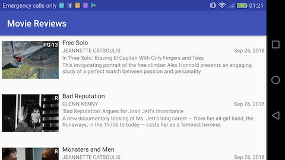

# Overview

The app consists of a single activity with a recycler view that shows a list of reviews obtained
from the REST API endpoint. The list:

1. automatically fetches new pages of reviews as the users scrolls to provide a seamless browsing
   experience. When the last 5 reviews become visible, it fetches the next page based on the
   number of reviews previously fetched.

1. provides support for pull-to-refresh to refresh reviews. This effectively discards all previously
   fetched reviews and fetches the first page again to get fresh data from the server.

It also supports portrait and landscape orientations. These are some screenshots of the app running
on a Huawei Honor 5x running Android 6.0.1 API 23:

# Implementation

The API uses Retrofit. There's a simple APIService interface and an API class with a convenient method
to initialize an APIService singleton with parameters and deserialization of dates lacking time zone.

The MainActivity has a RecyclerView and adapter that use the APIService singleton to fetch reviews
and display them in the UI. All request are async.

Review thumbnails are fetched and rendered using Picasso.

Feedback on activity and REST API errors is shown in toasts.

# Requirements

It was built with these tools:

Android Studio 3.2
Build #AI-181.5540.7.32.5014246, built on September 17, 2018
JRE: 1.8.0_152-release-1136-b06 x86_64
JVM: OpenJDK 64-Bit Server VM by JetBrains s.r.o
macOS 10.12.6

